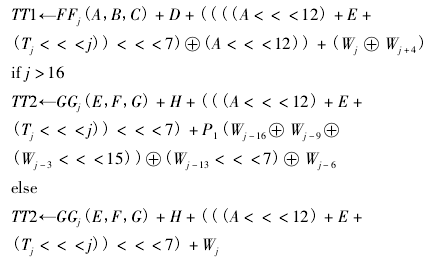

## sm3算法软件优化方法（同济版本优化）
* **对消息扩展字的优化**
    * **优化原因：** 原来的sm3算法对每一分组消息（512比特）采用132次扩展，即使用了132个变量来存储，并进行赋值操作。
    * **优化方法：** 把对消息的扩展操作合并到压缩函数之中，这样会减少许多赋值的操作，同时减少对消息扩展字的存储。
    * **具体步骤：**
        1. 在压缩函数进行64轮迭代之前，生成前4个消息扩展字使用w[0],w[1],w[2],w[3]进行存储。
        2. 在每一轮压缩函数的迭代中，首先进行w[i+4] (i为迭代轮数)的计算。
        3. w'无需存储，在每一轮迭代函数中，计算出了w[i+4],那么w'[i]就可以使用w[i] ^ w[i+4] 计算得出。
* **压缩函数中(Ti <<< (j mod 32))操作的优化**
    * **优化原因：** 在压缩函数64轮的迭代中，(Ti <<< (j mod 32)的操作结果分别对应着一个常量，这些操作在每个消息字的64轮迭代中频繁发生计算。
    * **优化方法：** 可以使用一个长度为64的数组进行存储(Ti <<< (j mod 32)操作，从而使得在每一轮压缩函数的迭代中进行查表操作即可获得结果，省去计算。（此操作相当于使用空间换时间，这部分空间可以视作对消息扩展字优化时省去的w'的空间）
* **对压缩函数中的中间变量进行优化**
    * **优化原因：** 压缩函数的每一轮迭代中，都会使用到SS1，SS2，TT1，TT2这些中间变量，在一轮的迭代中只是使用1到2次
    * **优化方法：** 减少中间变量的使用（SS1，SS2）。
    * **优化步骤：**  
    

* **总体步骤**
压缩函数：
1) $W_0 || W_1 || W_2 || W_3 ← B_0 || B_1 || B_2 || B_3$ 
2) $A || B || C || D || E || F || F || G || H ← V$
3) FOR i=0 TO 63{
        if i < 12 {
            $ W_{i+4}=B_{i+4} $
            $TT1←FF_i(A,B,C)+D+((((A<<<12)+E+(T_i<<<i))<<<7)$ ^ $(A<<<12))+(W_i$ ^ $W_{i+4})$
            $ TT2←GG_i(E,F,G)+H+(((A<<<12)+E+(T_i<<<7))<<<7)+W_i $
        }
        else if i>12 && i<16{
            $W_{i+4} ← P_1(W_{i-12}$ ^ $W_{i-5}$ ^ ($W_{i+1} <<< 15))$ ^ $(W_{i-9} <<< 7)$ ^ $W_{i-2}$
            $TT1←FF_i(A,B,C)+D+((((A<<<12)+E+(T_i<<<i))<<<7)$ ^ $(A<<<12))+(W_i$ ^ $W_{i+4})$
            $ TT2←GG_i(E,F,G)+H+(((A<<<12)+E+(T_i<<<7))<<<7)+W_i $
        }else i>16{
            $W_{i+4} ← P_1(W_{i-12}$ ^ $W_{i-5}$ ^ ($W_{i+1} <<< 15))$ ^ $(W_{i-9} <<< 7)$ ^ $W_{i-2}$
            $TT1←FF_i(A,B,C)+D+((((A<<<12)+E+(T_i<<<i))<<<7)$ ^ $(A<<<12))+(W_i$ ^ $W_{i+4})$
            $TT2←GG_i(E,F,G)+H+(((A<<<12)+E+(T_i <<< i))<<<7)+P_1(W_{i-16}$ ^ $W_{i-9}$ ^ $(W_{i-3}<<<15))$ ^ $(W_{i-13}<<<7)$ ^ $W_{i-6}$
        }
        D←C
        C←B<<<9
        ......
    }
        